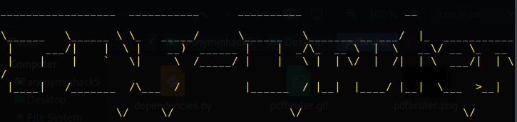
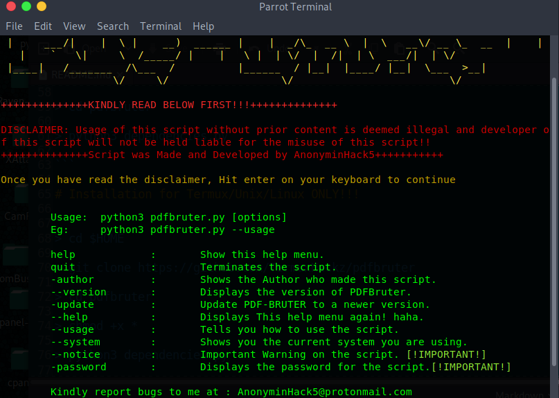
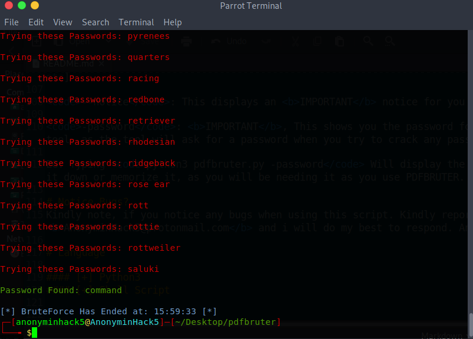
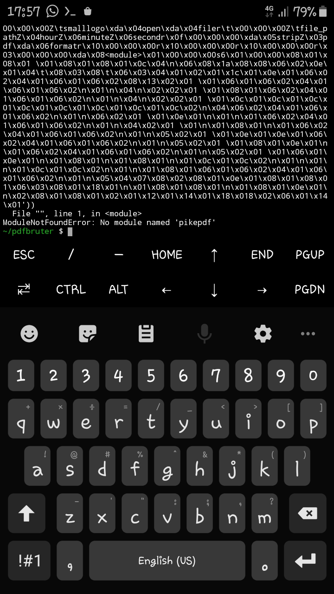

# pdfbruter
<p align="center">
pdfbruter is an offline dictionary cracking tool, which is essential for the cracking of PDF password protected files using a wordlist dictionary!. pdfbruter already comes with an inbuilt wordlist dictionary.

</p>

<h4 color="green">
pdfbruter is first script which actuall cracks a password protected file in a large size and cracks it fast all you need to do is to wait and be patient.





# Created by 
```
AnonyminHack5
```

# Tested On
pdfbruter has been tested on the following systems and certain that they work;

[✔] Termux

[✔] Parrot OS

[✔] Windows

[✔] lubuntu

[✔] Ubuntu

[✔] Slax Linux

[✔] Kali Linux

# Prequistics or Requirements to run this tool

[✔] 200mb of internet data/bundle and 200mb of storage

[✔] A linux environment

[✔] Python3

[✔] Figlet

# Menu


# Password Gotten 


# Wanna encourage us? 
To be able to encourage AnonyminHack5 with he's tools, make sure you use and rate he's <a href="https://t.me/Termux1_bot">Telegram bot</a>

# Features of PDFBRUTER
#### [+] Cracks Offline!!
#### [+] Cracks Fast!! [Depends on Wordlist]
#### [+] Good looking Interface lol!!
#### [+] Has a feature that detects the system your using
#### [+] Works with/without root!!


# Installation for Windows ONLY!!!
```
> git clone https://github.com/TermuxHackz/pdfbruter

> cd pdfbruter

> python -m pip install termcolor
  
> pip install pikepdf

> python3 pdfbruter.py --help

```

# Installation for Linux ONLY!!!

```
$ cd $HOME

$ git clone https://github.com/TermuxHackz/pdfbruter

$ cd pdfbruter

$ chmod +x *

$ pip3 install termcolor
  
$ pip install pikepdf

$ python3 dependencies.py

$ python3 pdfbruter.py --help
```

# Installation for Termux ONLY!
```
cd $HOME

git clone https://github.com/TermuxHackz/pdfbruter

cd pdfbruter

chmod +x *
  
pip install pikepdf

python3 termux-installenc.py

python3 pdfbruter.py --help
```

# Attention
Since pdfbruter is an offline password Cracking Tools for PDF files, Cracking process may take time and you need to wait and have patience, and in the mean time you could go grab a cup of coffee or watch some movies or have some snacks...lol (Save some for me, haha) then come back and check the pdfbruter.


# Usage
pdfbruter is pretty easy to use, after you typed and run the <code>python3 dependencies.py</code>, and you install all needed requirements.

## Usage2
Type <code>python3 pdfbruter.py --help </code>to see the tool's usage help menu. More Details...below

<code>-author</code>: Shows you who made the script

<code>--version</code>: Prints out the current version of pdfbruter.

<code>-update</code>: Updates pdfbruter to a newer version with new improved features and bugs fixed.

<code>--usage</code>: Shows you how to use/start pdfbruter.

<code>--system</code>: Tells you the current system you are using, eg [linux, windows, termux, ubuntu, etc]

<code>--notice</code>: This displays an <b>IMPORTANT</b> notice for you on the usage of pdfbruter

<code>-password</code>: <b>IMPORTANT</b>, This shows you the password for you to continue using the tool, as the tool will ask for a password when you try to crack any password protected PDF. 

EG: Typing <code>python3 pdfbruter.py -password</code> Will display the password, Copy password or note it down or memorize it, as you will be needing it as you use PDFBRUTER.

# Notice Bugs?
Kindly note, if you notice any bugs when using this script. Kindly report/mail them to me at: <b>AnonyminHack5@protonmail.com</b> and i will do my best to respond. And fix such bugs you reported.

# Language

#### [+] Python3
#### [+] Shell Script

I hope you all like this script

Kindly Star/Fork repo and continue to support me.

DO NOT COPY AND MODIFY THIS SCRIPT <b>LEECHERS BEWARE</b>

# Contact me
  #### > [+] Facebook: <a href="https://facebook.com/AnonyminHack5" target="_blank">AnonyminHack5</a>
  #### > [+] Whatsapp: <a href="https://wa.me/+2349033677589?text=Hi+AnonyminHack5+my+name+is+ ">AnonyminHack5</a>
  #### > [+] Twitter: <a href="https://twitter.com/AnonyminHack5" target="_blank">AnonyminHack5</a>
  #### > [+] Telegram: <a href="https://t.me/AnonyminHack5" target="_blank">AnonyminHack5</a>
  #### > [+] Telegram Bot: <a href="https://t.me/Termux1_bot" target="_blank">Termux Bot</a>
  #### > [+] Telegram Channel: <a href="https://t.me/termuxhackz1" target="_blank">TermuxHackz Society Channel</a>
  #### > [+] VMware Workstation pro for free: <a href="http://vmwaredownload.6te.net" target="_blank">Download VMware WorkStation for free</a>
  # Donations
  <p>Your donations can be sent to AnonyminHack5 to support him via paypal here => <a href="https://paypal.me/kwasconcept" target="_blank">Click to donate to AnonyminHack5</a></p>
  
  # Warning!!
  **Dear noobs/leechers, do not copy this code or try to modify it to make it yours, it took me a lot of time to make this script. Do not copy it, Dont be a Script Kiddie. Asshole...hahaha!!. Message from AnonyminHack5.**
  *Still want to message me, Message me on whatsapp <a href="https://wa.me/+2349033677589?text=Hello+AnonyminHack5+I+am ">here</a>*
  
# FAQs
#### > [1] I am having errors like Module import error as shown below


**Answer**: For those who are facing or having similar issues like this, kindly type <code>pip install pikepdf</code> and the error would be fixed then lastly type <code>python3 pdfbruter.py --help</code> to Start the pdfbruter and it would continue to work fine without any error.
